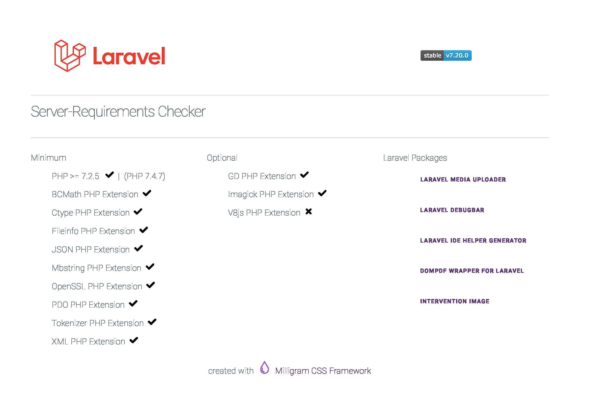

# Laravel-Install-Check
PHP Script to Check your Server Requirements

## Usage
Put the LaraCheck.php on your Server and open it in your Browser with: https://your-domain.xyz/LaraCheck.php

## Preview (Screenshot)

